# PA_information_to_knowlegde_graph

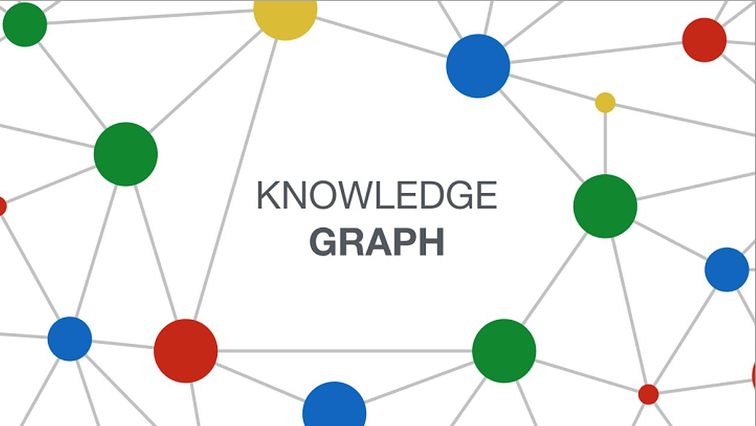

## Project Overview

The project processes text documents about public administration procedures and regulations to extract entities, relationships and build a knowledge graph that can be queried and analyzed.

### The Particularity of Knowledge Graphs (KGs)

> #### Why Knowledge Graphs (KGs) with RAG and LLMs are Effective ?

**Particularity of Knowledge Graphs (KGs)**

- **Structured Representation**: Organizes data as entities (nodes) and relationships (edges) with semantic meaning.
- **Semantic Context**: Enables systems to understand data beyond text, using ontologies for context.
- **Efficient Querying**: Handles complex, multi-hop queries, ideal for interconnected questions.
- **Transparency**: Provides clear links between data points, enhancing explainability.

**Why Use KGs with RAG and LLMs**

- **Enhanced Retrieval**: RAG retrieves precise, relevant context from KGs, reducing ambiguity.
- **Accuracy**: Structured data ensures reliable answers, avoiding LLM hallucinations.
- **Multi-Hop Reasoning**: KGs excel in traversing complex relationships, enriching query depth.
- **Efficiency**: Queries on KGs are faster and reduce computational loads on LLMs.
- **Explainability**: Answers are traceable to specific KG elements, improving trust and understanding.

KGs, when combined with RAG and LLMs, offer a robust system for extracting and querying information. They leverage KGs for precise data retrieval, RAG for relevant context, and LLMs for generating fluent and accurate responses, making them ideal for advanced question-answering applications.

## Methodology

We propose a methodology to transform unstructured textual data into knowledge graphs (KGs) using the Llama 3.1 (8B) language model and the Neo4j graph database. This approach, inspired by resources like the GitHub project “GraphRAG-with-Llama-3.1,” focuses on an integrated, high-performance solution for extracting, structuring, and querying knowledge:

- **Entity and Relation Extraction**:  
  Llama 3.1 (8B) processes text segments to identify key entities (e.g., people, places, concepts) and the relationships linking them (e.g., “works for,” “lives in,” “caused by”), enriched with attributes such as confidence or causality.

- **Structured Integration in Neo4j**:  
  Extracted entity–relation–entity triplets are stored incrementally in Neo4j. As new data is analyzed, the graph updates continuously, allowing intuitive exploration of connections.

- **Natural Language Querying**:  
  Users ask questions in plain language (e.g., “Who works for company X?”). Llama 3.1 translates these queries into Cypher commands to retrieve information from Neo4j, enabling discovery of complex or unexpected relationships.

Centered on Llama 3.1 (8B) and Neo4j, this methodology delivers a robust, scalable way to handle unstructured data, turn it into actionable graphs, and query it effectively. It captures advanced contextual nuances while providing the flexibility and scalability needed for use cases such as healthcare, scientific research, and recommendation systems.

## Key Components

- Text document parsing and preprocessing
- Named entity recognition and relationship extraction
- Ontology extraction and data modeling
- Ontology transformation to graph data
- Ontology embedding
- Knowledge graph construction
- Neo4j graph database integration
- GraphWidget visualization
- RAG framework for question answering
- Question answering capabilities using LLM and graph data

## Technology Stack

- **Python**: The primary programming language used for scripting and data processing.
- **Langchain**: A library for building applications with language models.
- **Neo4j**: A graph database used to store and query the knowledge graph.
- **Ollama**: An API for serving and interacting with language models.
- **LLama 3.1 8b model**: A large language model used for natural language processing tasks.
- **mxbai-embed-large model**: A model used for generating embeddings.
- **Google Colab**: A cloud-based Jupyter notebook environment used for running the code.

## Architecture

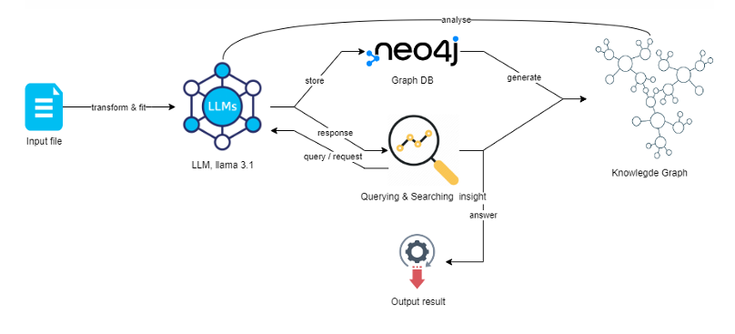

## Project Structure

```bash
.
├── assets/
│   ├── *.png
│   └── AP_Rapport_KG.pdf
│
├── dataset/
│   ├── data.pdf
│   ├── data.txt
│   └── 10.png
│
├── neo4j/
│   ├── neo4j_query_table_data_2024-12-26.csv
│   └── neo4j_query_table_data_2024-12-26.json
│
├── enhancing_rag_with_graph.ipynb
├── KG.ipynb
├── progress.json
└── README.md
```

## Dataset

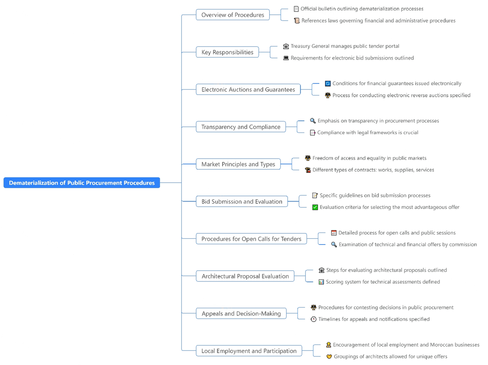

- The document highlights the transition to digital procurement processes
  processes, improving efficiency and transparency.
- It establishes clear responsibilities for the various stakeholders involved in public
  public procurement, ensuring accountability.
- The emphasis on electronic bidding and reverse auctions reflects a modern
  modern approach to procurement, cutting red tape and simplifying
  simplifying processes.
- Strict eligibility criteria and evaluation processes are essential to ensure that public procurement
  that public procurement is competitive and fair.
- The document describes the procedural safeguards necessary to protect public funds
  and maintain the integrity of procurement decisions.

<details>
<summary><h2>Data description</h2></summary>

> **رقمنة الإجراءات والوثائق والقطع المتعلقة بالمشتريات العامة في المغرب**

the official bulletin (BULLETIN OFFICIEL) Nº 7222, dated 30 moharrem 1445 (17-8-2023), containing a ministerial decree related to the digitization of public procurement procedures in Morocco.

### Introduction

- **Issuing Authority**: Minister Delegate to the Minister of Economy and Finance, in charge of the budget.
- **References**: Various laws and decrees related to public procurement, electronic transactions, and financial control.

### Chapter I: General Provisions

- **Article 1**: Scope of the decree, including:
  - Management of the public procurement portal.
  - Electronic submission and evaluation of bids.
  - Digitization of financial guarantees.
- **Article 2**: Definitions of key terms:
  - **Public Procurement Portal**: The official platform for managing public procurement processes.
  - **Actors**: Entities involved in the procurement process, such as contracting authorities, bidders, and control agents.
  - **Financial Guarantees**: Electronic guarantees related to procurement contracts.

### Chapter II: Management of the Public Procurement Portal

- **Article 7**: Responsibilities of the Treasury of the Kingdom:
  - **Technical Infrastructure**: Ensuring the portal's technical infrastructure is robust and secure.
  - **Maintenance**: Regular maintenance and updates to the portal.
  - **Account Management**: Managing user accounts and access permissions.
  - **Security**: Implementing security measures to protect data and transactions.

### Chapter III: Publication of Documents on the Portal

- **Article 8**: Responsibilities for publishing documents:
  - **Legislative Texts and Regulations**: Publishing relevant laws and regulations.
  - **Procurement Plans and Notices**: Publishing procurement plans, notices, and invitations to tender.
  - **Results of Procurement Processes**: Publishing the results of procurement processes and awarded contracts.

### Chapter IV: Electronic Submission and Withdrawal of Bids

- **Articles 9-14**: Procedures for electronic submission and withdrawal of bids:
  - **Encryption**: Ensuring the security of submitted bids through encryption.
  - **Timestamping**: Recording the exact time of submission to ensure deadlines are met.
  - **Late Submissions**: Handling bids submitted after the deadline, including rejection and notification procedures.
  - **Bid Withdrawal**: Procedures for bidders to withdraw their bids electronically before the deadline.

### Chapter V: Digitization of Financial Guarantees

- **Article 15**: Electronic processes for financial guarantees:
  - **Constitution**: Establishing electronic guarantees through authorized organizations.
  - **Return**: Procedures for returning guarantees to bidders and contract holders upon completion of obligations.
  - **Authorized Organizations**: Entities authorized to issue and manage electronic guarantees, ensuring their validity and security.

### Chapter VI: Electronic Opening and Evaluation of Bids

- **Articles 16-19**: Procedures for electronically opening and evaluating bids:
  - **Integrity**: Ensuring the integrity and confidentiality of the bid opening and evaluation process.
  - **Technical Difficulties**: Handling issues that may arise during the electronic opening and evaluation, including contingency plans and support mechanisms.
  - **Evaluation Criteria**: Detailed criteria for evaluating bids, ensuring transparency and fairness.

### Chapter VII: Electronic Reverse Auctions

- **Articles 20-42**: Guidelines for conducting electronic reverse auctions:
  - **Publication of Notices**: Announcing the auction and inviting participants through the public procurement portal.
  - **Minimum Participants**: Ensuring a minimum number of participants for a valid auction, promoting competition.
  - **Auction Phases**: Detailed steps and phases of the auction process, including initial bidding, live auction, and final evaluation.
  - **Bid Submission**: Procedures for submitting bids during the auction, including real-time updates and notifications.
  - **Auction Closure**: Criteria for closing the auction and determining the winning bid.

### Chapter VIII: Electronic Purchase Orders

- **Articles 43-45**: Conditions and procedures for issuing electronic purchase orders:
  - **Publication Requirements**: Publishing notices and results of purchase orders on the public procurement portal.
  - **Evaluation of Bids**: Criteria and procedures for evaluating bids for purchase orders, ensuring transparency and fairness.
  - **Order Issuance**: Procedures for issuing electronic purchase orders to successful bidders.

### Chapter IX: Digitization of Public Contract Pledges

- **Articles 46-48**: Electronic processes for pledging public contracts:
  - **Responsibilities**: Roles and responsibilities of contracting authorities, beneficiaries, and payment officers in the electronic pledging process.
  - **Procedures**: Steps for electronically pledging contracts, including documentation and approval processes.
  - **Security Measures**: Ensuring the security and validity of electronically pledged contracts.

### Chapter X: Interoperability with Third-Party Systems

- **Articles 49-52**: Integration with external systems:
  - **Confidentiality**: Ensuring the confidentiality of data exchanged with third-party systems.
  - **Proper Use**: Guidelines for the proper use of integrated systems and data, ensuring compliance with regulations.
  - **Technical Standards**: Adopting technical standards for interoperability, promoting seamless integration with external systems.

### Chapter XI: Digitization of Documents and Pieces

- **Articles 53-58**: Electronic establishment, storage, and transmission of documents:
  - **Electronic Signatures**: Use of electronic signatures to validate documents, ensuring their authenticity and integrity.
  - **Storage**: Secure storage of electronic documents, ensuring their availability and protection against unauthorized access.
  - **Transmission**: Procedures for transmitting documents electronically, ensuring secure and efficient communication.

### Chapter XII: Miscellaneous, Transitional, and Final Provisions

- **Articles 59-61**: Additional provisions:
  - **Exceptions**: Specific exceptions for certain public entities, outlining conditions under which they may be exempt from certain provisions.
  - **Effective Dates**: Dates when various provisions come into effect, ensuring a smooth transition to the new regulations.
  - **Abrogation**: Repeal of previous decrees that conflict with the new regulations, ensuring legal consistency.

### Summary

The document establishes a comprehensive framework for the digitization of public procurement processes in Morocco. It aims to enhance transparency, efficiency, and security through the use of digital technologies. The decree covers the management of the public procurement portal, electronic submission and evaluation of bids, digitization of financial guarantees, and interoperability with third-party systems. The detailed guidelines ensure that all aspects of the procurement process are digitized, secure, and compliant with relevant regulations.

</details>

## Steps

### Setup

- Install necessary libraries like langchain, neo4j, and ollama.
- Configure and start the Ollama server to serve the LLaMA 3.1 language model.

### Data Processing

- Define classes to represent nodes, relationships, and documents within the graph.
- Process text documents, extracting entities and relationships using the LLaMA model.
- Serialize and save the extracted data in a JSON format.

### Graph Creation

- Load the serialized data and create GraphDocument objects.
- Connect to a Neo4j database and store the graph documents, including nodes, relationships, and source documents.
- Create a full-text index on the node IDs for efficient searching.

### Querying and Answering

- Implement a function to extract entities from user questions.
- Perform a full-text search in Neo4j to retrieve relevant nodes.
- Combine graph data with relevant vector data (if available) to provide a comprehensive context.
- Use the LLaMA model to generate answers based on the combined context.

## Guide

1. Install Required Packages.

   - Use "%pip install …" to install libraries like langchain, neo4j, tiktoken, etc.
   - Install pciutils with "!sudo apt-get install -y pciutils".
   - Install Ollama via "!curl -fsSL https://ollama.com/install.sh | sh".

2. Configure the Ollama API & Download the Model.

   - Set environment variables and run "ollama serve" in a new thread.
   - Pull the LLama 3.1 model with "!ollama pull llama3.1".

3. Define Classes for Nodes and Relationships.

   - Classes Node and Relationship store id/type/properties and link two nodes.
   - Documents hold metadata and page_content.
   - GraphDocument combines nodes, relationships, and document source.

4. Process and Serialize Documents into Graphs.

   - Use ChatOllama (model="llama3.1") for entity/relationship extraction.
   - Define a serialize_document function to convert objects to JSON.
   - Convert each document chunk into a GraphDocument, save progress to "progress.json".

5. Load and Transform JSON into GraphDocuments.

   - Read data from "progress.json".
   - Rebuild GraphDocuments (nodes, relationships, source document).

6. Configure Neo4j Connection and Add Documents.

   - Retrieve Neo4j URI, username, password from environment variables.
   - Create a GraphDatabase driver and a Neo4jGraph instance.
   - Add GraphDocuments using graph.add_graph_documents.

7. Create a Full-Text Index in Neo4j.

   - Run a Cypher query in a write transaction to build a full-text index.

8. Define Functions for Entity Extraction and Graph Retrieval.

   - extract_entities_from_text uses LLama to find entities.
   - graph_retriever runs full-text searches in Neo4j and retrieves relationships.

9. Build a Full Retriever and a Q&A Chain.

   - Combine graph data (graph_retriever) and vector data (vector_retriever).
   - Use a ChatPromptTemplate and chain them with the language model.

10. Run Q&A.

- Invoke the chain on a question.
- Display the final answer, showing references to “Graph data” or “Vector data”.

## Results

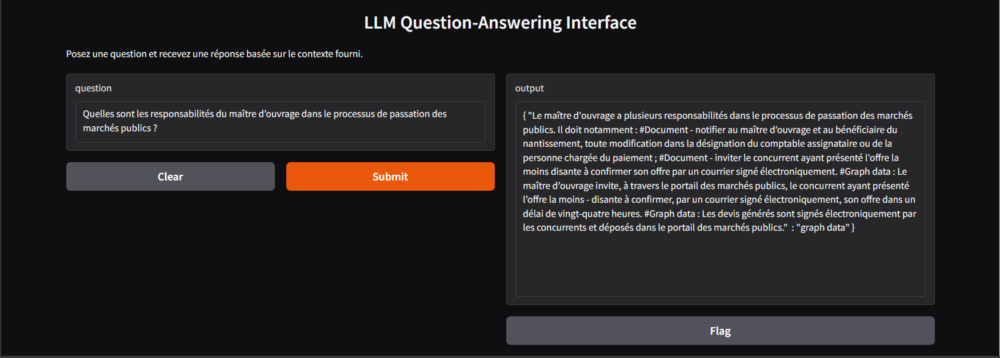
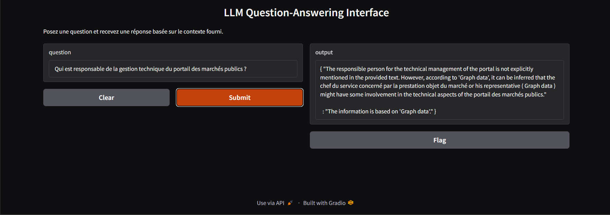
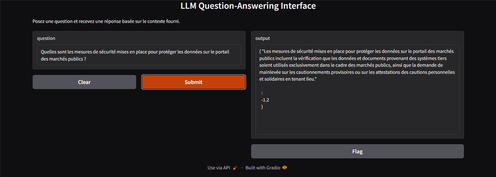
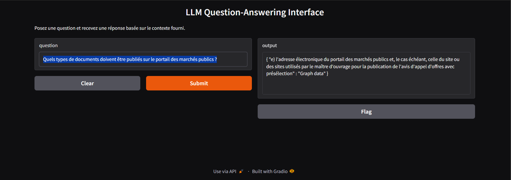
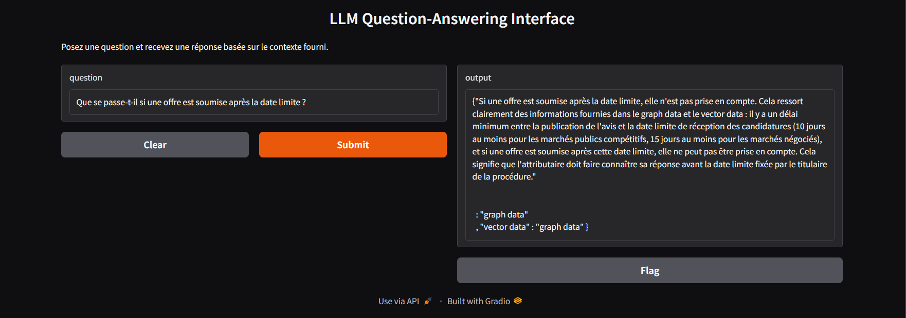
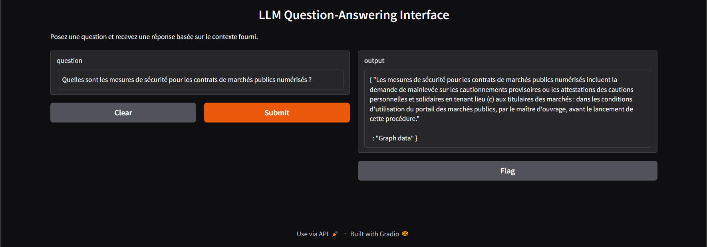
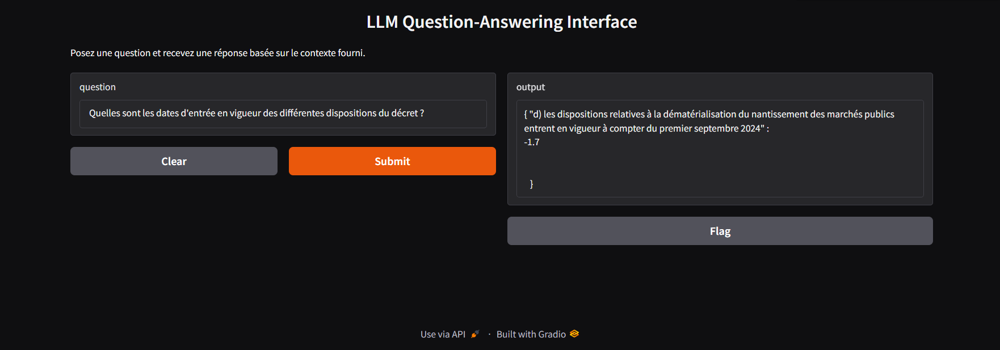
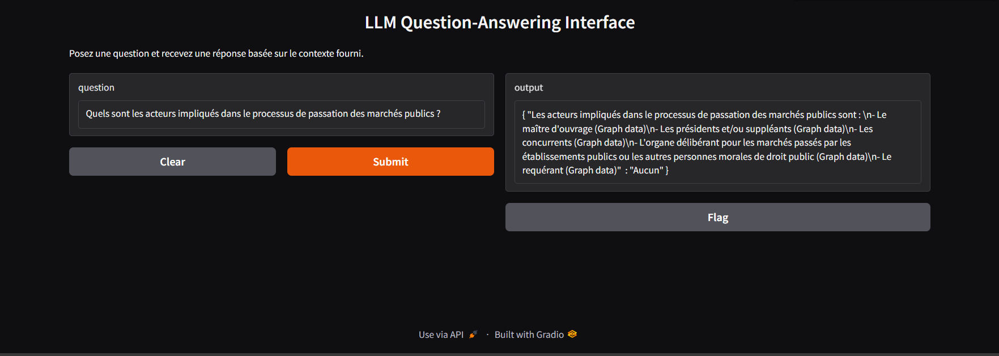
